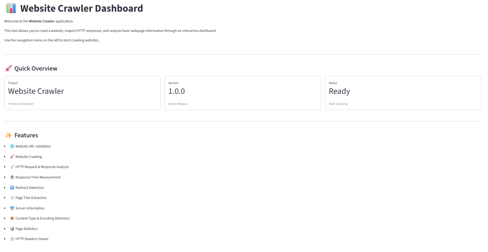
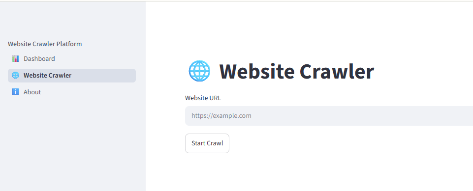

# 🌐 Website Crawler

A modern Python-based **Website Crawler** built with **Streamlit** that allows users to crawl websites, inspect HTTP responses, and extract essential webpage information through a clean and interactive dashboard.

This project is designed as a beginner-friendly demonstration of web crawling concepts using Python, Requests, BeautifulSoup, and Streamlit.

---

# 📌 Overview

Website Crawler is a lightweight web crawling application that retrieves information from a webpage and presents it in an organized dashboard.

It validates a URL, performs an HTTP request, downloads the webpage, extracts useful information, and displays website statistics for analysis.

Unlike SEO auditing tools, this project focuses solely on **website crawling and webpage inspection**.

---

# ✨ Features

- 🌐 Website URL Validation
- 🚀 Website Crawling
- 📡 HTTP Request & Response Analysis
- ⏱️ Response Time Measurement
- 🔄 Redirect Detection
- 📄 Page Title Extraction
- 🖥️ Server Information
- 📦 Content Type Detection
- 🔤 Encoding Detection
- 📏 Content Length Information
- 📊 Website Statistics
  - Total Links
  - Total Images
  - Total Scripts
  - Total Stylesheets
- 📑 HTTP Response Headers Viewer
- 📈 Interactive Dashboard

---

# 🛠️ Tech Stack

## Frontend

- Streamlit

## Backend

- Python

## Libraries

- Requests
- BeautifulSoup4
- Pandas
- Python-dotenv

---

# 📁 Project Structure

```text
website-crawler/
│
├── app.py
├── config.py
├── requirements.txt
├── README.md
├── LICENSE
│
├── pages/
│   ├── dashboard.py
│   ├── website_crawler.py
│   └── about.py
│
├── services/
│   └── crawler.py
│
├── utils/
│   ├── helpers.py
│   └── validators.py
│
└── assets/
```

---

# 🚀 Installation

## Clone the repository

```bash
git clone https://github.com/admin-pynovatech/website-crawler.git
```

## Navigate to the project

```bash
cd website-crawler
```

## Create a virtual environment

```bash
python -m venv .venv
```

## Activate the environment

### Windows

```bash
.venv\Scripts\activate
```

### Linux / macOS

```bash
source .venv/bin/activate
```

## Install dependencies

```bash
pip install -r requirements.txt
```

## Run the application

```bash
streamlit run app.py
```

---

# 📊 Workflow

```text
User Enters Website URL
          │
          ▼
     URL Validation
          │
          ▼
    HTTP Request Sent
          │
          ▼
   Download Webpage HTML
          │
          ▼
 Extract Website Information
          │
          ▼
 Display Crawl Results
```

---

# 📋 Current Modules

### 📊 Dashboard

Displays an overview of the crawler application.

### 🌐 Website Crawler

Performs website crawling and displays:

- HTTP Status Code
- Response Time
- Redirect Count
- Website Information
- Page Statistics
- HTTP Headers

### ℹ️ About

Provides project information, technologies used, and application overview.

---

# 📂 Information Extracted

The crawler currently extracts:

## Request Information

- Final URL
- HTTP Status Code
- Response Time
- Redirect Count

## Website Information

- Page Title
- Protocol
- Server
- Content Type
- Character Encoding
- Content Length

## Page Statistics

- Total Links
- Total Images
- Total Scripts
- Total Stylesheets

## HTTP Information

- Response Headers

---

# 🎯 Future Improvements

Planned enhancements include:

- robots.txt Detection
- sitemap.xml Detection
- Favicon Detection
- HTML Language Detection
- Charset Detection
- Forms Counter
- Buttons Counter
- Video & Audio Detection
- Cookie Analysis
- Security Headers Inspection
- Multi-page Crawling
- Asynchronous Crawling using asyncio
- FastAPI REST API
- Docker Support

---

# 🤝 Contributing

Contributions, suggestions, and improvements are welcome.

To contribute:

1. Fork the repository
2. Create a new feature branch

```bash
git checkout -b feature-name
```

3. Commit your changes

```bash
git commit -m "Add new feature"
```

4. Push to your branch

```bash
git push origin feature-name
```

5. Open a Pull Request

---

## Screenshots

### Dashboard



---

### Website Crawler



---

### Crawl Results


---

### About


---

# 📄 License

This project is licensed under the **MIT License**.

See the **LICENSE** file for more information.

---

# 👨‍💻 Maintained By

## PyNova Tech

Building modern AI, Data Analytics, and Python solutions.

GitHub:
https://github.com/admin-pynovatech

> This repository is maintained by **PyNova Tech** as an educational and portfolio project demonstrating modern Python development practices.

---

# 🏢 About PyNova Tech

PyNova Tech develops practical software solutions in:

- 🤖 Artificial Intelligence
- 🧠 Agentic AI
- 📊 Data Analytics
- 🐍 Python Development
- ⚙️ Automation
- 🌐 Web Applications
- 📈 Stock Market Automation
- 💼 Custom Python Solutions

This repository is part of the PyNova Tech open-source portfolio showcasing practical, production-inspired Python applications.

---

# 🌟 Support

If you found this project useful:

- ⭐ Star this repository
- 🍴 Fork the project
- 🐛 Report issues
- 💡 Share suggestions
- 🤝 Contribute to the project

Your support helps improve open-source Python projects and motivates future development.