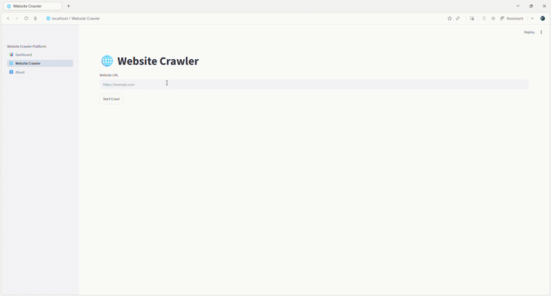
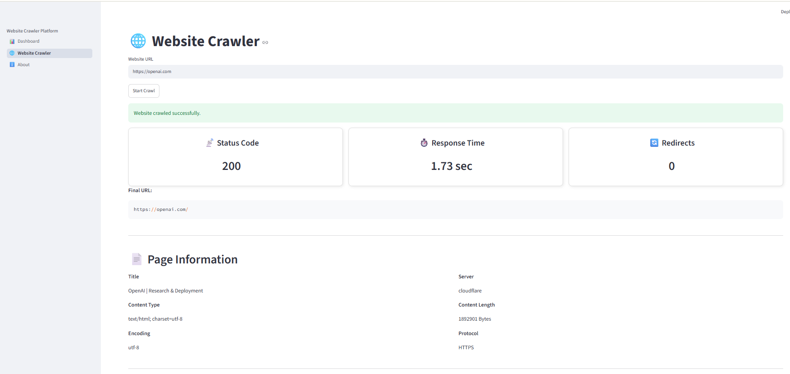
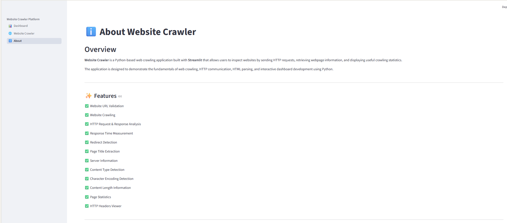

# 🌐 Website Crawler


A modern **Website Crawler** built with **Python**, **Streamlit**, **Requests**, and **BeautifulSoup** that allows users to crawl websites, inspect HTTP responses, and extract essential webpage information through an interactive dashboard.

This project demonstrates the fundamentals of **web crawling**, **HTTP communication**, **HTML parsing**, and **interactive dashboard development** using Python.

---

# 🎥 Demo



---

# 🚀 What I Can Build

This project demonstrates my ability to design and develop Python applications with a clean architecture, interactive user interfaces, and practical automation features.

I can build custom Python solutions such as:

- 🌐 Website Crawlers & Web Scrapers
- 📊 Data Analytics Dashboards
- 📈 Business Intelligence Applications
- 🤖 AI & LLM Powered Applications
- ⚙️ Workflow & Process Automation
- 📂 PDF, Excel & CSV Processing Tools
- 📧 Email & Report Automation
- 🔌 REST APIs using FastAPI
- 🗄️ Database-Driven Applications
- ☁️ Cloud & Deployment Ready Solutions

Whether it's a proof of concept, an internal business tool, or a production-ready application, I focus on writing clean, maintainable, and scalable Python code.

---

# 📌 Overview

The Website Crawler performs the following tasks:

- Validates website URLs
- Sends HTTP requests
- Downloads webpage HTML
- Parses webpage content
- Extracts useful metadata
- Displays website statistics
- Presents HTTP response information in a clean dashboard

Unlike SEO auditing tools, this project focuses purely on **website crawling and webpage inspection**.

---

# 💡 Why This Project?

The purpose of this project is to demonstrate practical software engineering skills rather than simply crawling webpages.

It showcases:

- Modular Python project architecture
- HTTP communication using Requests
- HTML parsing with BeautifulSoup
- Interactive dashboards with Streamlit
- Clean UI/UX design
- Error handling and validation
- Configuration management
- Maintainable and reusable code structure

These are the same engineering practices used when building production-ready Python applications.

---

# 🚀 Key Highlights

- Modular Project Architecture
- Beginner-Friendly Python Project
- Interactive Streamlit Dashboard
- HTTP Request & Response Analysis
- HTML Parsing using BeautifulSoup
- Clean and Responsive UI
- Open Source

---

# ✨ Features

- 🌐 Website URL Validation
- 🚀 Website Crawling
- 📡 HTTP Request & Response Analysis
- ⏱️ Response Time Measurement
- 🔄 Redirect Detection
- 📄 Page Title Extraction
- 🖥️ Server Information
- 📦 Content Type Detection
- 🔤 Character Encoding Detection
- 📏 Content Length Information
- 📊 Website Statistics
    - Total Links
    - Total Images
    - Total Scripts
    - Total Stylesheets
- 📑 HTTP Response Headers Viewer
- 📈 Interactive Dashboard

---

# 📸 Screenshots

## Dashboard


## Website Crawler


## Crawl Results



## About



---

# 🛠️ Tech Stack

| Category | Technologies |
|-----------|--------------|
| Language | Python |
| Frontend | Streamlit |
| HTTP Client | Requests |
| HTML Parser | BeautifulSoup4 |
| Data Processing | Pandas |
| Configuration | python-dotenv |

---

# 📁 Project Structure

```text
website-crawler/
│
├── app.py
├── config.py
├── requirements.txt
├── README.md
├── LICENSE
│
├── pages/
│   ├── dashboard.py
│   ├── website_crawler.py
│   └── about.py
│
├── services/
│   └── crawler.py
│
├── utils/
│   ├── helpers.py
│   └── validators.py
│
├── screenshots/
│
└── assets/
```

---

# 🚀 Installation

Clone the repository

```bash
git clone https://github.com/admin-pynovatech/website-crawler.git
```

Navigate to the project

```bash
cd website-crawler
```

Create a virtual environment

```bash
python -m venv .venv
```

Activate the environment

Windows

```bash
.venv\Scripts\activate
```

Linux / macOS

```bash
source .venv/bin/activate
```

Install dependencies

```bash
pip install -r requirements.txt
```

Run the application

```bash
streamlit run app.py
```

---

# 📋 Requirements

- Python 3.10+
- pip
- Internet Connection

---

# 💻 Example Usage

Enter a website URL such as:

```text
https://openai.com
```

The crawler analyzes the webpage and displays:

- HTTP Status Code
- Response Time
- Redirect Count
- Final URL
- Website Information
- Page Statistics
- HTTP Response Headers

---

# 📊 Workflow

```text
User Enters Website URL
          │
          ▼
     URL Validation
          │
          ▼
    HTTP Request Sent
          │
          ▼
   Download Webpage HTML
          │
          ▼
 Extract Website Information
          │
          ▼
 Display Crawl Results
```

---

# 📂 Information Extracted

## Request Information

- Final URL
- HTTP Status Code
- Response Time
- Redirect Count

## Website Information

- Page Title
- Protocol
- Server
- Content Type
- Character Encoding
- Content Length

## Page Statistics

- Total Links
- Total Images
- Total Scripts
- Total Stylesheets

## HTTP Information

- Response Headers

---

# 📚 Learning Objectives

This project demonstrates practical experience with:

- Python Programming
- Requests Library
- BeautifulSoup
- HTTP Protocol
- Web Crawling
- HTML Parsing
- Streamlit
- Modular Project Design
- Error Handling
- Configuration Management

---

# 🎯 Future Improvements

### Website Analysis

- robots.txt Detection
- sitemap.xml Detection
- HTML Language Detection
- Favicon Detection
- Cookie Analysis
- Security Headers Inspection

### Content Analysis

- Forms Counter
- Buttons Counter
- Video & Audio Detection
- Internal & External Link Detection

### Performance

- Multi-page Crawling
- Asynchronous Crawling using asyncio

### Deployment

- FastAPI REST API
- Docker Support

---

# 🤝 Contributing

Contributions are welcome.

1. Fork the repository.
2. Create a feature branch.

```bash
git checkout -b feature-name
```

3. Commit your changes.

```bash
git commit -m "Add new feature"
```

4. Push to GitHub.

```bash
git push origin feature-name
```

5. Open a Pull Request.

---

# 📄 License

This project is licensed under the **MIT License**.

See the **LICENSE** file for additional information.

---

# 👨‍💻 Maintainer

**PyNova Tech**

Building practical solutions in:

- 🤖 Artificial Intelligence
- 🧠 Agentic AI
- 📊 Data Analytics
- 🐍 Python Development
- ⚙️ Automation
- 🌐 Web Applications

GitHub:

https://github.com/admin-pynovatech

---

# 🎯 Available for Custom Development

If you're looking for custom Python development, I can help with projects such as:

- Custom Web Crawlers
- Data Extraction & Automation
- Streamlit Dashboards
- AI-Powered Applications
- FastAPI Backend Development
- Business Automation Tools
- Data Processing Pipelines

Feel free to explore my repositories to see more Python projects demonstrating different technologies and real-world use cases.

---

# ⭐ Support

If you found this project helpful:

- ⭐ Star this repository
- 🍴 Fork the repository
- 🐛 Report issues
- 💡 Suggest improvements
- 🤝 Contribute

Your support helps improve future open-source Python projects.